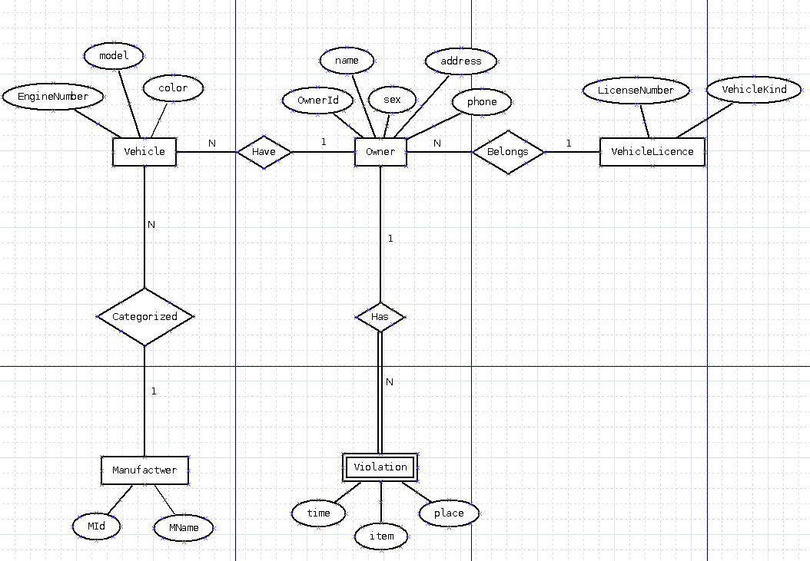

# TKU_107-1_CSIE_Database
## 淡江大學資料庫課程期末分組報告

### 監理站製作一查緝車輛系統。
### 該系統可以記載車主名下機車，當該車輛違規時，
### 系統即可傳簡訊給車主。此一系統的資料需求如下：

1.	車輛 (Vehicle)：包括引擎號碼 (EngineNumber)、車型 (model)、顏色 (color)、引擎號碼為唯一。

2.	廠牌 (Manufacturer)：包括廠牌編號 (MId)、廠牌名稱 (MName)，其中廠牌編號為唯一。

3.	車主 (Owner)：車主需記載身分證字號 (OwnerId)、姓名 (name)、性別 (sex)、住址 (address)，和電話 (phone)。其中車主編號為唯一。

4.	違規事項 (Violation)：包括時間(time)、違規項目 (item)、違規地點(place)，一位車主可設數個違規。

5.	行照(VehicleLicense)：包括牌照號碼 (LicenseNumber) 和車種 (VehicleKind)。

### 此外，

* 1.	Vehicle 跟 Manufacturer間有一個 Categorized 的關係型態，
		* 一台車必屬於一種廠牌，但一廠牌可有數種車。

* 2.	Violation 與 Owner間有個Has 的關係型態，
		* 一個車主可有數個違規事項，但一個違規事項只有一人。

* 3.	Owner 跟 VehicleLicense間也有個屬於 (Belongs) 的關係型態，
		* 一個人有數種行照，但一行照只能一人擁有。
	
### 該資料ER Model如下：

